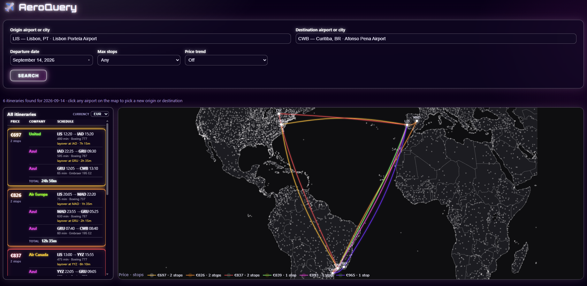

# AeroQuery

A web app for searching one-way flights and visualizing the results on
an interactive route map. Enter an origin, destination, and date; it scrapes
Google Flights and shows every itinerary as both a sortable list and bowed
flight paths on a world map, so you can compare price, stops, and layovers
at a glance.



## Features

- **Route map** — each itinerary is drawn as a curved path between airports,
  color-coded by result, with hover details (airline, price, stops, layover
  durations). Click a route to highlight it, or click any airport dot to
  pick a new origin/destination and search again.
- **Price trend** — an optional sweep across a window of nearby departure
  dates, streamed in progressively over Server-Sent Events and charted on a
  log scale so you can see whether your date is a good one. Off by default;
  see `AEROQUERY_PRICE_TREND_DAYS` below.
- **Itinerary cards** — per-leg times, aircraft type, and layover duration
  for every result, sorted by price.
- **Neon dark theme** — one fixed cyberpunk palette shared by the map,
  trend chart, and cards.
- Filter by max stops (nonstop, 1 stop, 2 stops, or any), and by currency.

## Architecture

- **`core/`** — framework-agnostic Python: the Google Flights search, the
  price-trend sweep, and the Plotly figure builders. No web framework
  imports; covered by `pytest` (`uv run pytest`).
- **`api/`** — a FastAPI service wrapping `core/`. Serves the JSON API under
  `/api/*` and, once the frontend is built, the SPA at `/`.
- **`web/`** — a Vite + React + TypeScript frontend that calls `/api/*` and
  renders the maps with `react-plotly.js`.

(This replaced an earlier single-file Streamlit app — see
[`.claude/js-migration-plan.md`](.claude/js-migration-plan.md) for the
migration writeup.)

## Getting started

Requires Python 3.10+, [uv](https://docs.astral.sh/uv/), and Node.js 20+.

```bash
uv sync

# Build the frontend once, then run everything from one process:
cd web && npm install && npm run build && cd ..
uv run uvicorn api.main:app --port 8000
```

Open <http://localhost:8000>, enter an origin/destination airport (by IATA
code, city, or name) and a departure date, and search.

### Development

Run the API and the Vite dev server (with hot-reload) side by side:

```bash
uv run uvicorn api.main:app --reload --port 8000   # terminal 1
cd web && npm run dev                              # terminal 2
```

Then open the URL Vite prints (typically <http://localhost:5173>); it
proxies `/api/*` to the backend on port 8000.

### Configuration

- `AEROQUERY_PRICE_TREND_DAYS` — number of consecutive departure dates the
  price-trend sweep covers, centered on the searched date. Defaults to `1`
  (no sweep — just the searched date), so a run doesn't fire ~180 Google
  Flights requests per search unless asked to. Set e.g. `181` for a
  six-month window.

## How it works

Flight data comes from [`fast-flights`](https://github.com/AWeirdDev/flights),
which queries Google Flights directly — no API key required. A custom fetch
integration attaches an EU cookie-consent cookie so requests from the EU/EEA
skip Google's consent wall. Airport coordinates for the map come from
[`airportsdata`](https://github.com/mborsetti/airportsdata), and the maps
are rendered with Plotly.

## License

Apache 2.0 — see [LICENSE](LICENSE).
